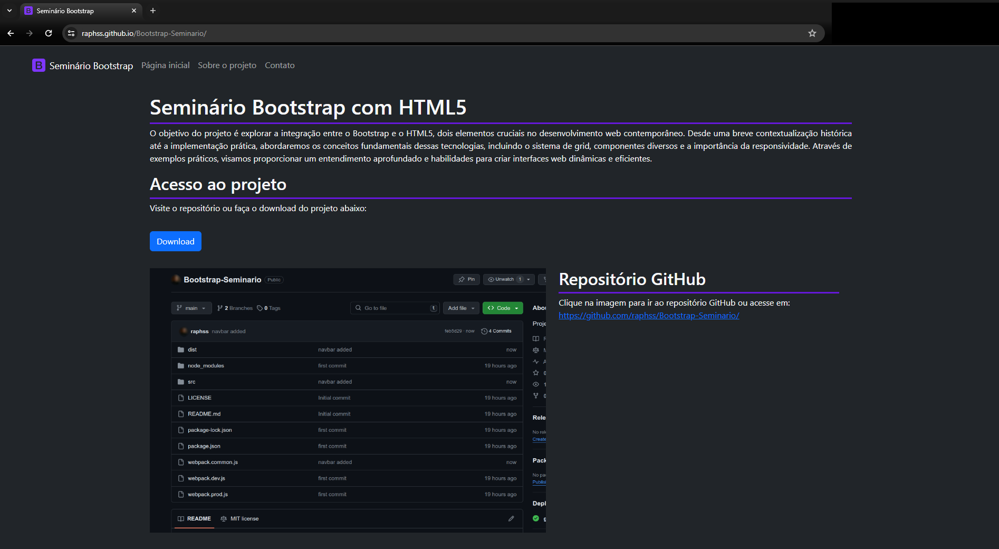

# Bootstrap-Seminario

> Seminário sobre a ferramente Bootstrap 5 em conjunto com HTML5.

[![Live website][url-image]][url]

    

<!-- Markdown link & img dfn's -->
[url]: https://raphss.github.io/Bootstrap-Seminario/
[odp-url]: https://www.theodinproject.com
[url-image]: https://img.shields.io/badge/Live_Website-purple
